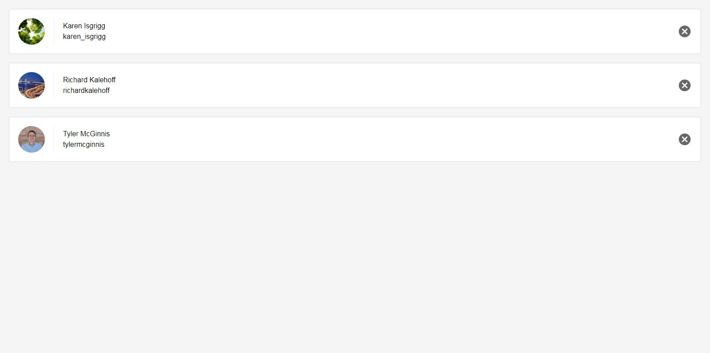
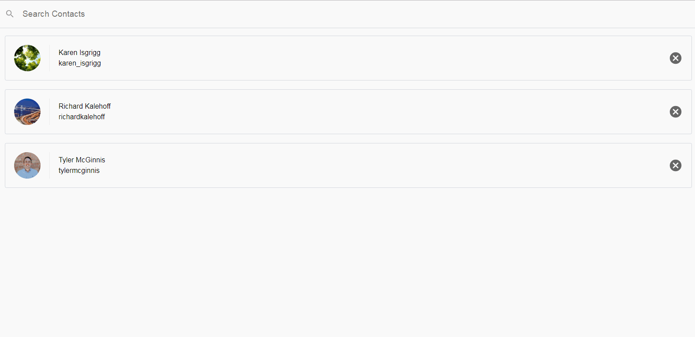
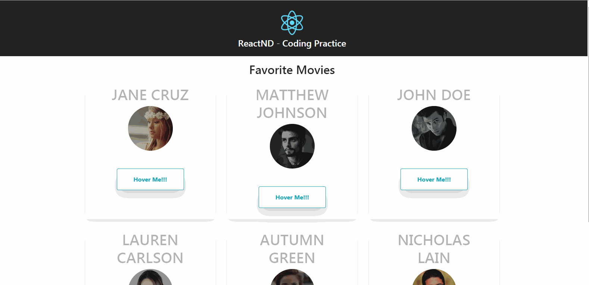
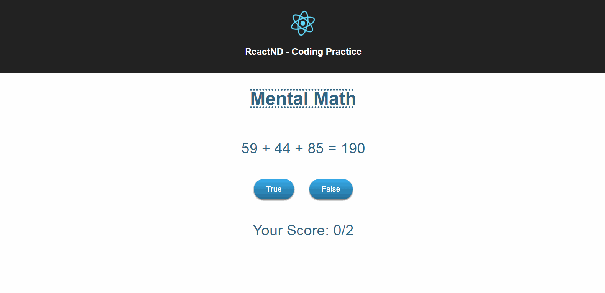
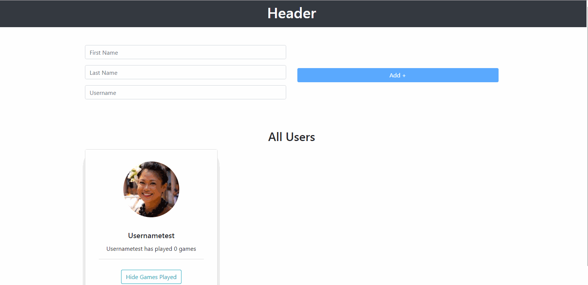
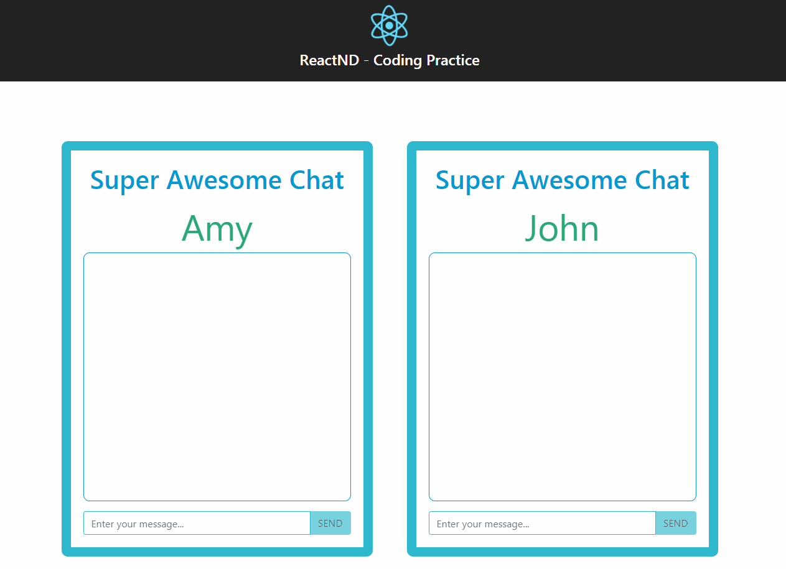

# Udacity React NanoDegree Excercises
Each branch is dedicated to an exercise.  Branch's are prefixed with the lesson number as well for quick reference.   
## Course Notes
Course notes are written using standard markdown via [stackedit.io](https://stackedit.io).  Notes are located in the `docs/notes` directory on the `master` branch.  Notes are regularly updated as I progress through the course.

**[View Course Notes](docs/notes/table_of_contents.md)** 

## Exercises 
### Lesson 3

### Contact List App
- **Project:** Build a contact  list app
- **Branch** [lesson_3/contacts_app](https://github.com/eddielee394/udacity_react_excercises/tree/lesson_3/contacts_app) 

### Contact List App
- **Project:** Build a contact  list app
- **Description** Displays a list of contacts and search functionality.  Contacts can also be deleted by clicking the delete button. 
- **Branch** [lesson_3/contacts_app](https://github.com/eddielee394/udacity_react_excercises/tree/lesson_3/contacts_app) 

#### Exercise 1
- **Project:** Favorite Movie List 
- **Description** Displays user profile cards and the user's associated favorite movies
- **Branch**: [lesson_3/exercise_1](https://github.com/eddielee394/udacity_react_excercises/tree/lesson_3/exercise_1) 

### Exercise 2
- **Project:** Movie Profiles
- **Description** Displays movie profile cards and all the associated users t hat have favorited that movie.  
- **Branch:** [lesson_3/exercise_2](https://github.com/eddielee394/udacity_react_excercises/tree/lesson_3/exercise_2)

### Exercise 3
- **Project:** Functional components
- **Description** Uses tabbed components to display user profile cards and the user's associated favorite movies.  The movies tab displays the movie profile cards and all the associated users that have favorited that movie.   
- **Branch:** [lesson_3/exercise_3](https://github.com/eddielee394/udacity_react_excercises/tree/lesson_3/exercise_3)

### Exercise 4
- **Project:** Managing State
- **Description** Math quiz app that randomly generates a simple equation and user can select whether the displayed sum is correct.  Score is displayed as the number of correct answers compared to the total number of questions answered. 
- **Branch:** [lesson_3/exercise_4](https://github.com/eddielee394/udacity_react_excercises/tree/lesson_3/exercise_4)

### Exercise 7
- **Project:** All Together
- **Description** Basic form functionality that adds a new user with unique username validation and dynamic state updating.  Also includes toggle functionality that displays the number of games a user has played when the "Show games played" button is clicked on each user profile.  
- **Branch:** [lesson_3/exercise_7](https://github.com/eddielee394/udacity_react_excercises/tree/lesson_3/exercise_7)

### Exercise 8
- **Project:** All Together (Chat Application)
- **Description** Basic chat application between two users.  Sender messages are always displayed in green, while recipient messages are always displayed in blue. Message submit button is disabled if no message is present in the add message field.   
- **Branch:** [lesson_3/exercise_8](https://github.com/eddielee394/udacity_react_excercises/tree/lesson_3/exercise_8)
