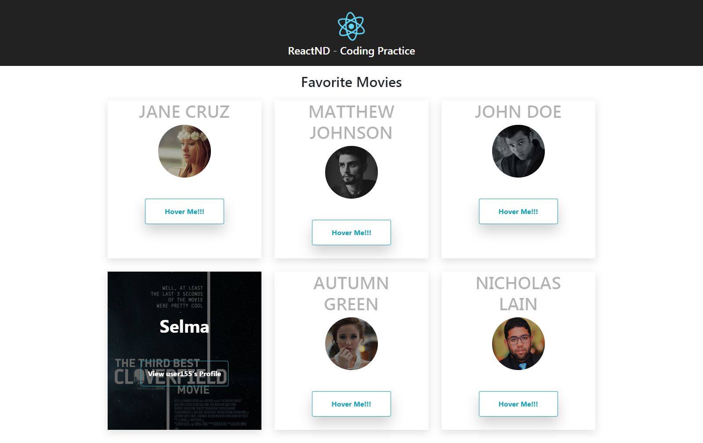
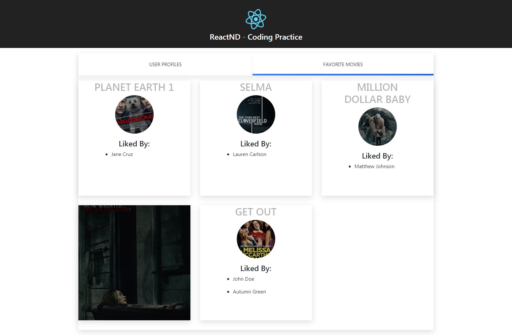
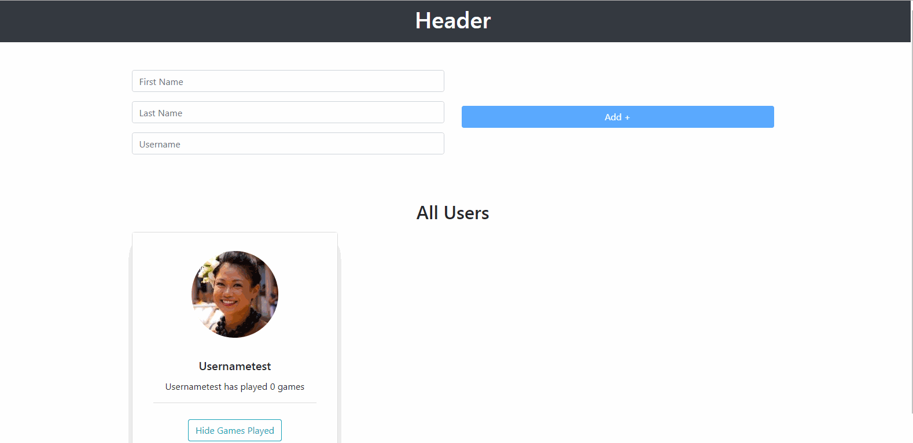

# Udacity React NanoDegree Excercises
Each branch is dedicated to an exercise.  Branch's are prefixed with the lesson number as well for quick reference.   
## Course Notes
Course notes are written using standard markdown via [stackedit.io](https://stackedit.io).  Notes are located in the `_docs/notes` directory on the `master` branch.  Notes are regularly updated as I progress through the course.

**[View Course Notes](_docs/notes/table_of_contents.md)** 

## Exercises 
### Lesson 3

### Contact List App
- **Project:** Build a contact  list app
- **Branch** [lesson_3/contacts_app](https://github.com/eddielee394/udacity_react_excercises/tree/lesson_3/contacts_app) 

#### Exercise 1
- **Project:** Favorite Movie List 
- **Branch**: [lesson_3/exercise_1](https://github.com/eddielee394/udacity_react_excercises/tree/lesson_3/exercise_1) 

### Exercise 2
- **Project:** Movie Profiles 
- **Branch:** [lesson_3/exercise_2](https://github.com/eddielee394/udacity_react_excercises/tree/lesson_3/exercise_2)

### Exercise 3
- **Project:** Functional components 
- **Branch:** [lesson_3/exercise_3](https://github.com/eddielee394/udacity_react_excercises/tree/lesson_3/exercise_3)

### Exercise 4
- **Project:** Managing State 
- **Branch:** [lesson_3/exercise_4](https://github.com/eddielee394/udacity_react_excercises/tree/lesson_3/exercise_4)

### Exercise 7
- **Project:** All Together
- **Description** Basic form functionality that adds a new user with unique username validation and dynamic state updating.  Also includes toggle functionality that displays the number of games a user has played when the "Show games played" button is clicked on each user profile.  
- **Branch:** [lesson_3/exercise_7](https://github.com/eddielee394/udacity_react_excercises/tree/lesson_3/exercise_7)
