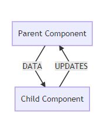

## Composition

Composition occurs when simple functions are combined together to create more complex functions. Think of each function as a single building block that does one thing(DOT). When you combine these simple functions together to form a more complex function, this is composition.

Key ingredients to composition:

-   Simple functions
-   Combined to create another function

DOT Rule:

-   Do One Thing

-   Single Responsibility principle

[https://www.linkedin.com/pulse/compose-me-function-composition-javascript-kevin-greeneh](https://www.linkedin.com/pulse/compose-me-function-composition-javascript-kevin-greeneh)ttps://hackernoon.com/javascript-functional-composition-for-every-day-use-22421ef65a10

## Declarative Code

Imperative code instructs JavaScript on how it should perform each step. With declarative code, we tell JavaScript what we want to be done, and let JavaScript take care of performing the steps.

React is declarative because we write the code that we want, and React is in charge of taking our declared code and performing all of the JavaScript/DOM steps to get us to our desired result.

Example:

```<button onClick={activateTeleporter}>Activate Teleporter</button>```
`

[https://tylermcginnis.com/imperative-vs-declarative-programming/](https://tylermcginnis.com/imperative-vs-declarative-programming/)

[https://stackoverflow.com/questions/33655534/difference-between-declarative-and-imperative-in-react-js](https://stackoverflow.com/questions/33655534/difference-between-declarative-and-imperative-in-react-js)

## Unidirectional Data Flow
**Data-Binding In Other Frameworks**
Front-end frameworks like  [Angular](https://angular.io/)  and  [Ember](https://emberjs.com/)  make use of two-way data bindings. In two-way data binding, the data is kept in sync throughout the app no matter where it is updated.

**React's Data-flow**
Data moves differently with React's unidirectional data flow. In React, the data flows from the parent component to a child component.



_Data flows down from parent component to child component. Data updates are sent to the parent component where the parent performs the actual change._
<!--stackedit_data:
eyJoaXN0b3J5IjpbLTE0NDM4MTE4NTFdfQ==
-->